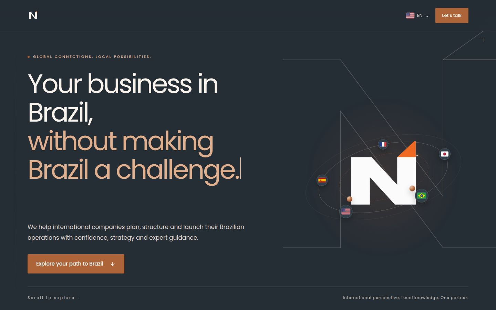
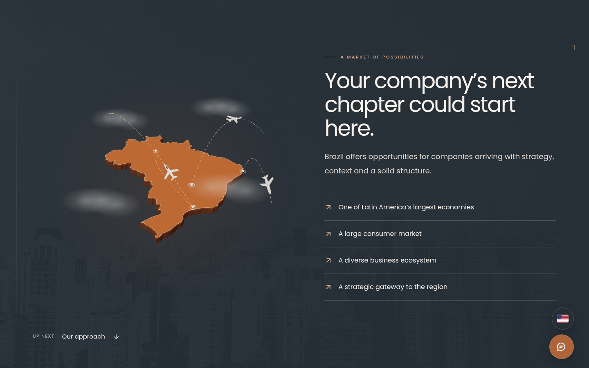
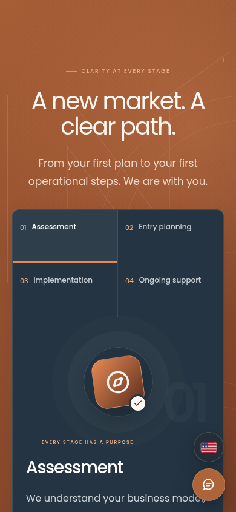

# Nordion

Responsive React application for an international business consultancy, with multilingual content, interactive 3D scenes, and client-side briefing export.

## Screenshots

### Desktop






### Mobile

| Home | Process |
| --- | --- |
|  |  |

## Requirements

- Node.js 22.12 or later
- npm

## Installation

```sh
npm ci
npm run dev
```

## Commands

| Command | Description |
| --- | --- |
| `npm run dev` | Start the Vite development server. |
| `npm run lint` | Run Oxlint; errors and warnings fail the command. |
| `npm run build` | Run TypeScript checks and generate the production build in `dist/`. |
| `npm run preview` | Serve the production build locally. |

## Technology Stack

| Layer | Technology |
| --- | --- |
| UI | React 19, TypeScript |
| Build | Vite, React Vite plugin |
| Styling | Tailwind CSS, CSS stylesheets, locally hosted Poppins |
| Accessible controls | React Aria Components |
| Carousels | Embla Carousel |
| 3D rendering | Three.js, React Three Fiber |
| Static analysis | Oxlint, TypeScript |

## Project Structure

```text
src/
  components/   UI controls, section components, and visual scenes
  config/       Contact configuration
  data/         Geographic outline, city geometry, and team profiles
  locales/      Brazilian Portuguese, English, and Spanish content
  styles/       Layout, animation, and responsive styles
  App.tsx       Page composition and dialog state
  main.tsx      Application entry point
public/
  brand/        Brand assets
  images/       Local photographs
docs/
  screenshots/  Desktop and mobile captures
```

## Application Behavior

Each section occupies one viewport (`100svh`). Decorative scenes scale with the available space. Overflow remains scrollable within the section for expanded content and increased text sizes.

The page contains eleven sequential sections: home, Brazil, approach, process, services, values, who we are, team, organizational structure, contact, and FAQ. The opening CTA advances to Brazil; subsequent sections use a floating home, previous, and next navigation control.

Language content is defined in `src/locales`. The selected locale persists in browser local storage under `nordion-language`.

The opening constellation supports pointer and keyboard interaction. The Brazil map and city use separately loaded React Three Fiber scenes. Animation is limited to visible scenes, with static alternatives for reduced-motion preferences or unavailable WebGL.

The team section includes seven named roles and a responsive organizational chart. Company email and Instagram links are available in the contact interface and footer. The floating contact control uses a single local PNG and always opens the contact dialog. WhatsApp, when configured, is a link inside that dialog. Floating contact controls appear after scrolling and hide when the contact section or footer is visible.

The briefing form validates required fields and exports their values as `nordion-briefing.txt`. File generation runs in the browser through the Blob API; it does not require an API endpoint.

## Environment Variables

Create `.env.local` using `.env.example` as a reference.

| Variable | Required | Description |
| --- | --- | --- |
| `VITE_WHATSAPP_NUMBER` | No | International telephone number, including country code, using digits only. Enables the floating WhatsApp link when valid. |

Vite reads environment variables at startup and build time. Restart the development server after changes. Set production variables before running the build.

## Deployment

```sh
npm ci
npm run lint
npm run build
```

Deploy the contents of `dist/` to a static host. `vercel.json` includes a rewrite to `index.html` for Vercel deployments.

## Asset Sources

See [image and geographic data credits](docs/image-credits.md) for asset attribution and license references.
